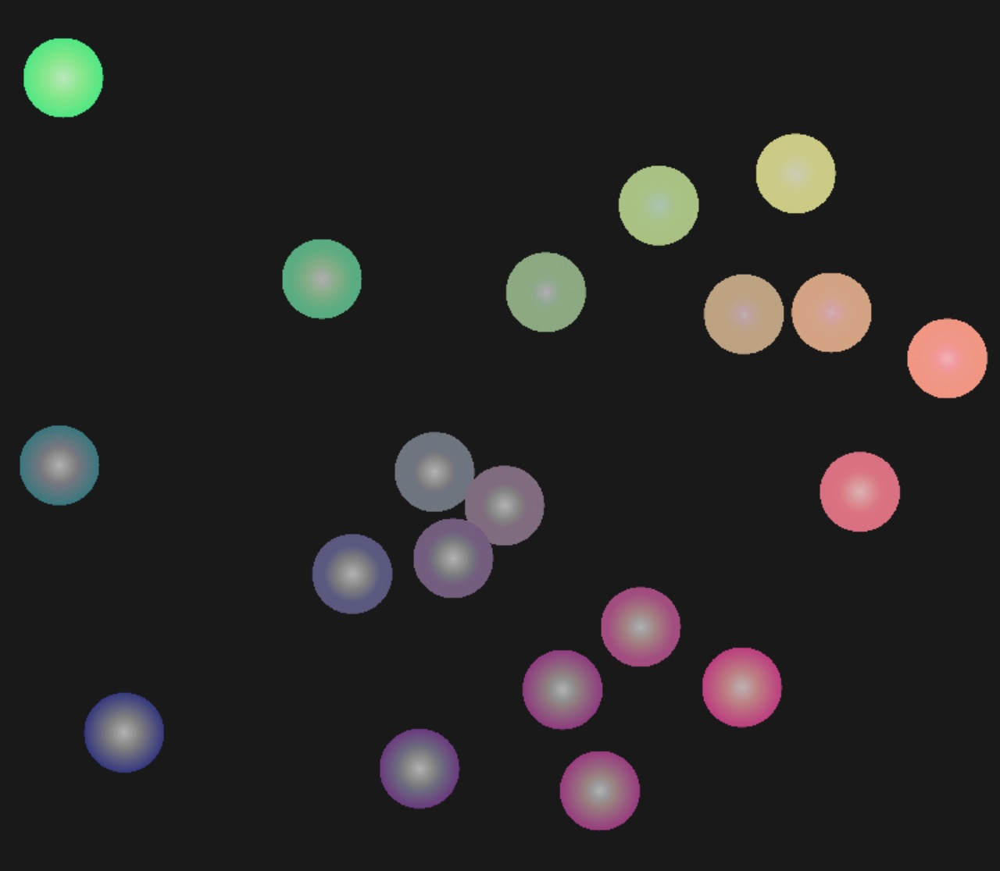
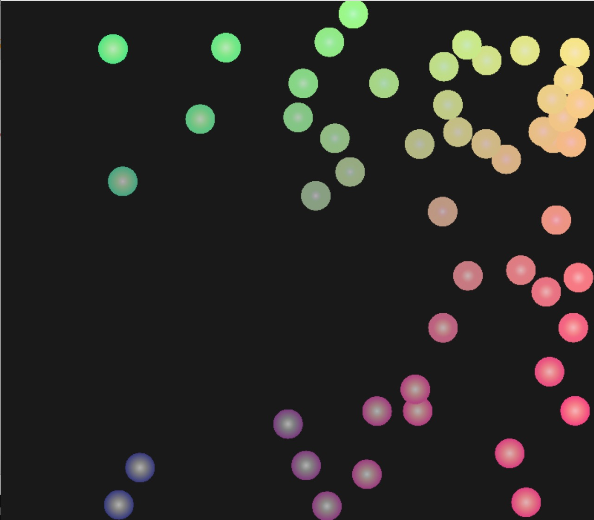

# 小球弹性碰撞
基于webGL的小球弹性碰撞demo

**小球弹性碰撞**：

- **小球设置** ：小球位置，速度，角度由random函数生成，其中角度由x，y轴速度控制；
- **小球颜色** ：小球颜色由小球所在位置计算得出，色值 = 小球位置 * 0.5， 同时增加由圆心向外的渐变效果；
- **小球碰撞** ：小球碰撞有小球撞击墙壁与撞击其他小球两种情况，有两个撞击的弹性参数决定反弹力。
 


-------------------


## 小球撞击墙体

> 小球撞击墙壁，在move函数中进行判断，如果撞击墙壁，则将撞击方向的速度 v * bounce （撞击墙壁弹性）
> 
### 代码块
``` javascript
    this.balls.forEach(a => {
        a.x += a.vx;
        a.y += a.vy;
        if (a.x > this.R) {
            a.x = this.R;
            a.vx *= this.bounce;
        }
        if (a.x < this.L) {
            a.x = this.L;
            a.vx *= this.bounce;
        }
        if (a.y > this.T) {
            a.y = this.T;
            a.vy *= this.bounce;
        }
        if (a.y < this.B) {
            a.y = this.B;
            a.vy *= this.bounce;
        }
    });
```